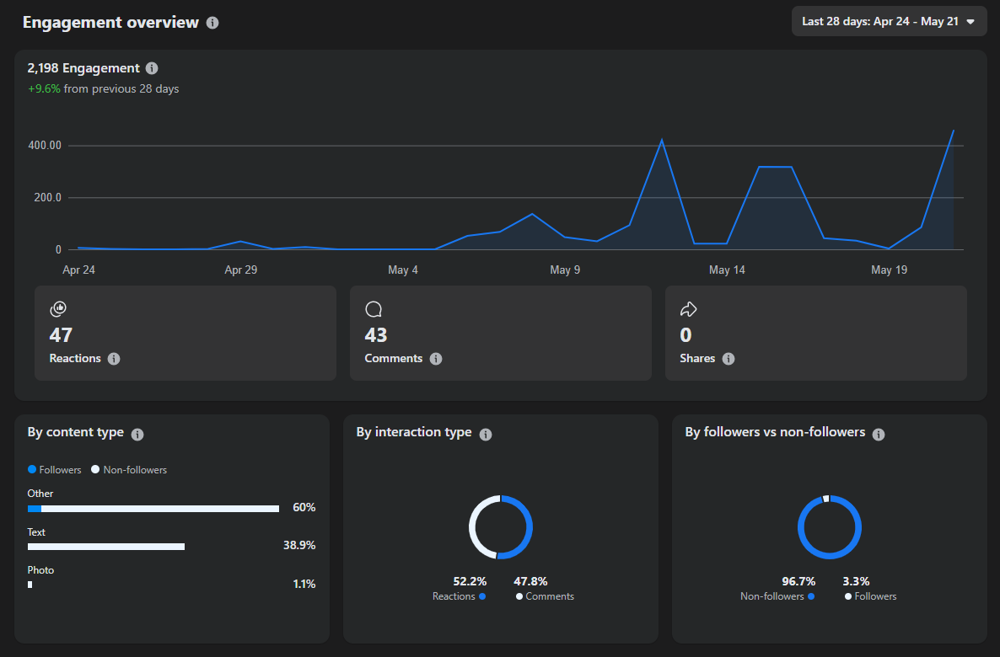
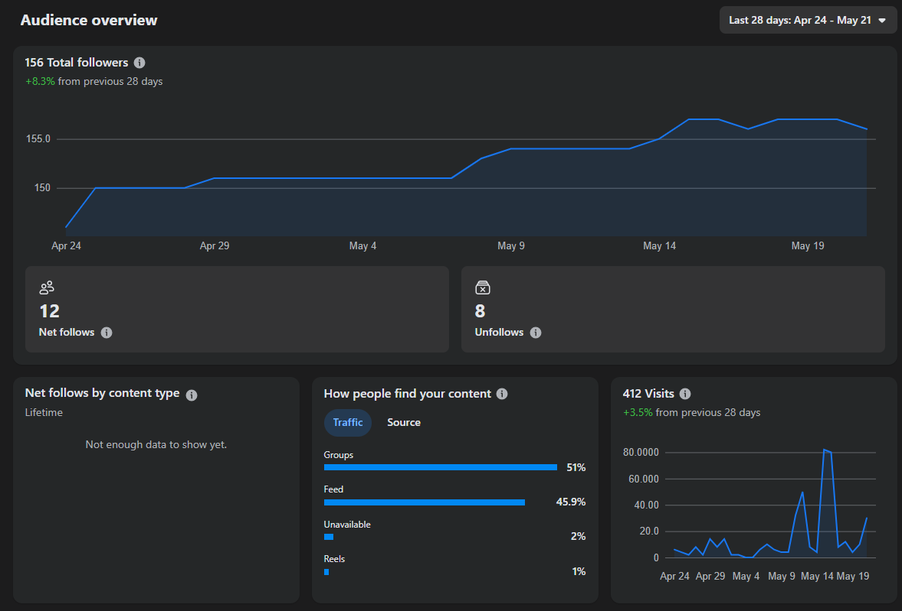
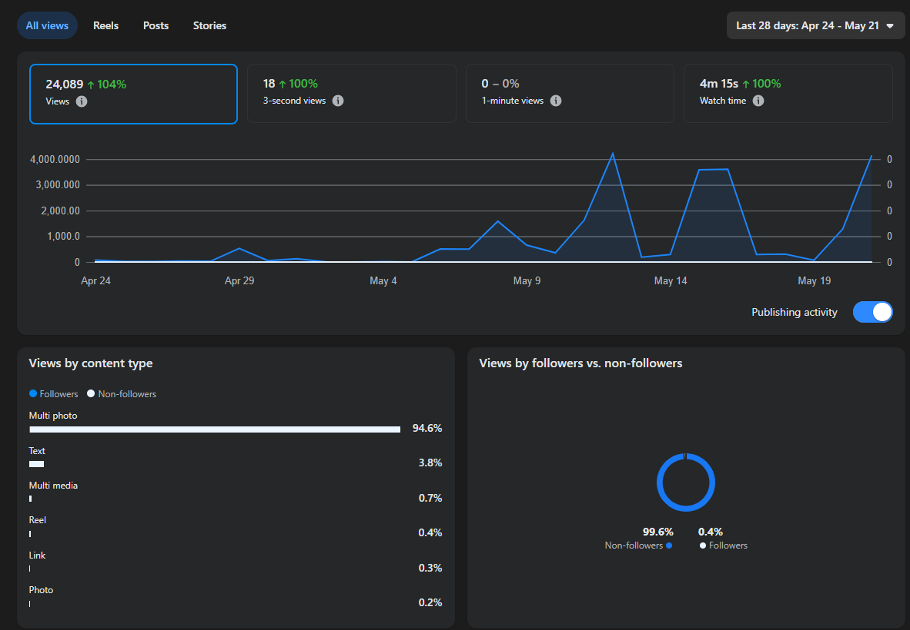

# Real-Estate Lead Automation Framework
An automated tool for scraping, analyzing, and generating real-estate leads using Selenium, Gemini AI, and Firebase. It streamlines listing distribution across social platforms and uses AI to identify high-quality customer leads in real-time.

---

## 🚀 Key Features
- **Smart Scraper:** Filters and extracts property listings from the web by area, price, and amenities.
- **AI Lead Filtering:** Uses Gemini 1.5 Flash to identify genuine buyers/renters on social media while filtering out spam and brokers.
- **Cloud License System:** Uses Firebase to authorize users via Hardware ID (HWID) and manage token limits.
- **Background Multi-threading:** Runs automation and live-monitoring tasks concurrently in the background.
- **Interactive HUD:** Built with CustomTkinter to show real-time process logs inside a clean desktop window.

---

## 📊 Performance
Since the implementation of the automation framework, the tool has delivered significant positive impact over the past 28 days:

<div align="center">
   
  <br>
  
</div>

**Key Results:**
* **Total Reach:** Over 24,000 unique impressions, a 104% increase compared to the previous period.
* **Engagement:** Achieved over 2,100 interactions, demonstrating highly effective content targeting.
* **Traffic:** 51% of traffic originated from Facebook Groups, validating the efficiency of the "Auto Post Group" module.
* **Audience:** 99.6% of the reach consisted of non-followers, confirming the framework's success in expanding potential lead acquisition.

## 🏗️ System Architecture

```text
+-------------------------------------------------------------+
|                     User Control Panel                      |
|             (CustomTkinter GUI Engine & Live HUD)           |
+-------------------------------------------------------------+
                              |
                              v
+-------------------------------------------------------------+
|                   HWID Security Controller                  |
|          (Remote License Validation via Firebase REST)      |
+-------------------------------------------------------------+
                              |
       +----------------------+----------------------+
       | (Scraping Mode)                             | (Standalone Hunter Mode)
       v                                             v
+----------------------------+         +----------------------------+
|    Web Automation Core     |         |  Social Stream Monitoring  |
|     (Selenium WebDriver)   |         |    (Target Post Scanner)   |
+----------------------------+         +----------------------------+
       |                                             |
       |  [Extracts Property Listings]               |  [Intercepts Raw Social Leads]
       v                                             v
+----------------------------+         +----------------------------+
|    Dynamic Filter Engine   |         |      Gemini 1.5 Flash      |
|  (Amenity & Budget Match)  |         |   (Contextual NLP Parsing) |
+----------------------------+         +----------------------------+
       |                                             |
       |  [Structured Content Cache]                 |  [Verified Buyer Lead Matrix]
       +----------------------+----------------------+
                              |
                              v
+-------------------------------------------------------------+
|                  Omnichannel Action Layer                   |
|     (Zalo Album Dispatcher & Facebook Cross-Group Relays)   |
+-------------------------------------------------------------+
                              |
                              v
+-------------------------------------------------------------+
|                     Firebase Telemetry                      |
|         (Operational Logs & Live Credit Deductions)         |
+-------------------------------------------------------------+
```

⚙️ **Core Technical Stack**
- Language: Python 3.10+
- **Automation:** Selenium WebDriver (Edge Engine)
- **Artificial Intelligence:** Google Generative AI SDK (gemini-2.5-flash)
- **Database & Cloud Security:** Firebase Realtime Database (REST API Integration)
- **Graphical Interface:** CustomTkinter & Native Tkinter Event Queue
- **Data Processing:** Pandas & OpenPyXL


```markdown
## 📦 Installation & Setup

1. **Clone the Repository:**
```bash
git clone https://github.com/Kamiya1337/Auto-Scraper-Bot.git
cd Auto-Scraper-Bot
```

2. **Install Dependencies:**
```bash
pip install -r requirements.txt
```
*(Note: Ensure you have `customtkinter`, `google-generativeai`, `pandas`, `openpyxl`, `selenium`, and `python-dotenv` installed).*

3. **Configure Environment Variables:**
Create a `.env` file in the root directory based on the `.env.example` structure:
```env
GEMINI_API_KEY=your_google_gemini_api_key
FIREBASE_URL=your_firebase_realtime_database_endpoint
TARGET_URL=your_target_property_website_url
```

4. **Execute the Application:**
```bash
python main.py
```
🔒 Security & Best Practices
**Environment Configurations:** Database endpoints, and target URLs are loaded via a secure .env file, keeping the codebase completely clean and abstract.
**Dynamic Cooldowns:** Built-in sleep variations mimic human behavior to prevent rapid requests and protect social accounts from getting flagged.

📄 License
This project is licensed under the MIT License - see the LICENSE file for details. This repository is hosted strictly for educational purposes and technical evaluation.
